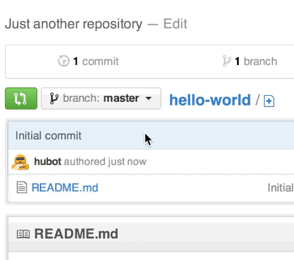

# Create a Branch

Step 2. Create a Branch

Branching is the way to work on different versions of a repository at one time.

By default your repository has one branch named master which is considered to be the definitive branch. We use branches to experiment and make edits before committing them to master.

When you create a branch off the master branch, you’re making a copy, or snapshot, of master as it was at that point in time. If someone else made changes to the master branch while you were working on your branch, you could pull in those updates.

This diagram shows:

    The master branch
    A new branch called feature (because we’re doing ‘feature work’ on this branch)
    The journey that feature takes before it’s merged into master

Have you ever saved different versions of a file? Something like:

    story.txt
    story-joe-edit.txt
    story-joe-edit-reviewed.txt

Branches accomplish similar goals in GitHub repositories.

Here at GitHub, our developers, writers, and designers use branches for keeping bug fixes and feature work separate from our master (production) branch. When a change is ready, they merge their branch into master.
To create a new branch

    Go to your new repository hello-world.
    Click the drop down at the top of the file list that says branch: master.
    Type a branch name, readme-edits, into the new branch text box.
    Select the blue Create branch box or hit “Enter” on your keyboard.
    

Now you have two branches, master and readme-edits. They look exactly the same, but not for long! Next we’ll add our changes to the new branch.