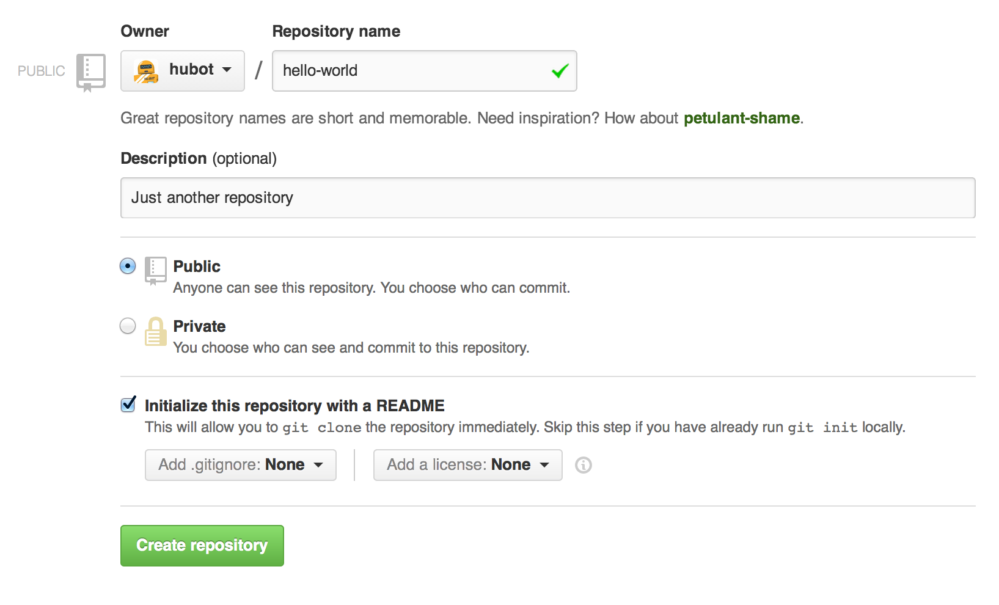

# Create a Repository

Step 1. Create a Repository

A repository is usually used to organize a single project. Repositories can contain folders and files, images, videos, spreadsheets, and data sets – anything your project needs. We recommend including a README, or a file with information about your project. GitHub makes it easy to add one at the same time you create your new repository. It also offers other common options such as a license file.

Your hello-world repository can be a place where you store ideas, resources, or even share and discuss things with others.
To create a new repository

1.  In the upper right corner, next to your avatar or identicon, click+ and then select **New repository**.
2.  Name your repository ```hello-world```.
3.  Write a short description.
4.  Select Initialize this repository with a README.




Click Create repository. :tada: