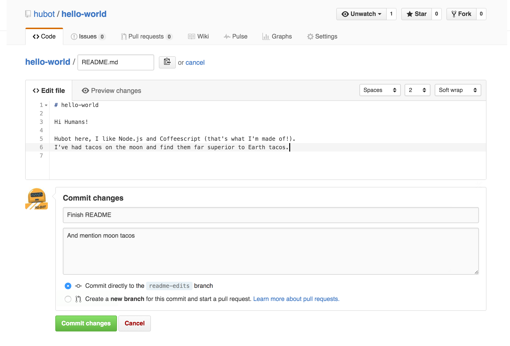

# Make a Commit

# Step 3. Make and commit changes

Bravo! Now, you’re on the code view for your ```readme-edits``` branch, which is a copy of ```master```. Let’s make some edits.

On GitHub, saved changes are called *commits*. Each commit has an associated *commit message*, which is a description explaining why a particular change was made. Commit messages capture the history of your changes, so other contributors can understand what you’ve done and why.
## Make and commit changes

1.    Click the ```README.md``` file.
2.    Click the pencil icon in the upper right corner of the file view to edit.
3.    In the editor, write a bit about yourself.
4.    Write a commit message that describes your changes.
5.    Click **Commit changes** button.



These changes will be made to just the README file on your ```readme-edits``` branch, so now this branch contains content that’s different from ```master```.