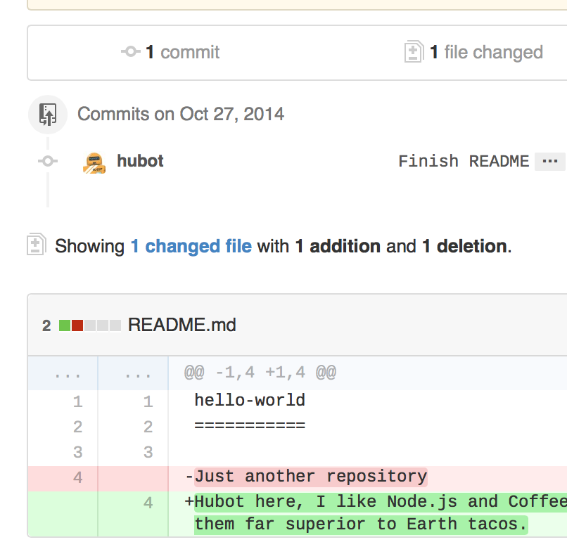

# Open a Pull Request
# Step 4. Open a Pull Request

Nice edits! Now that you have changes in a branch off of ```master```, you can open a *pull request*.

Pull Requests are the heart of collaboration on GitHub. When you open a *pull request*, you’re proposing your changes and requesting that someone review and pull in your contribution and merge them into their branch. Pull requests show *diffs*, or differences, of the content from both branches. The changes, additions, and subtractions are shown in green and red.

As soon as you make a commit, you can open a pull request and start a discussion, even before the code is finished.

By using GitHub’s [@mention system](https://help.github.com/articles/about-writing-and-formatting-on-github/#text-formatting-toolbar) in your pull request message, you can ask for feedback from specific people or teams, whether they’re down the hall or 10 time zones away.

You can even open pull requests in your own repository and merge them yourself. It’s a great way to learn the GitHub Flow before working on larger projects.
## Open a Pull Request for changes to the README

*Click on the image for a larger version*
Step 	Screenshot

1. Click the
Pull Request tab, then from the Pull Request page, click the green New pull request button. 	
   

2. Select the branch you made, readme-edits, to compare with master (the original). 	
   
3. Look over your changes in the diffs on the Compare page, make sure they’re what you want to submit. 	
4. When you’re satisfied that these are the changes you want to submit, click the big green Create Pull Request button. 	
5. Give your pull request a title and write a brief description of your changes. 	

When you’re done with your message, click **Create pull request!**

> Tip: You can use [emoji](https://help.github.com/articles/basic-writing-and-formatting-syntax/#using-emoji) and [drag and drop images and gifs](https://help.github.com/articles/file-attachments-on-issues-and-pull-requests/) onto comments and Pull Requests.
